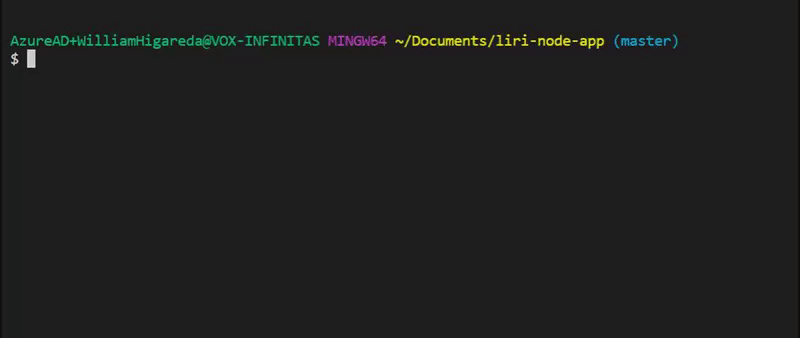
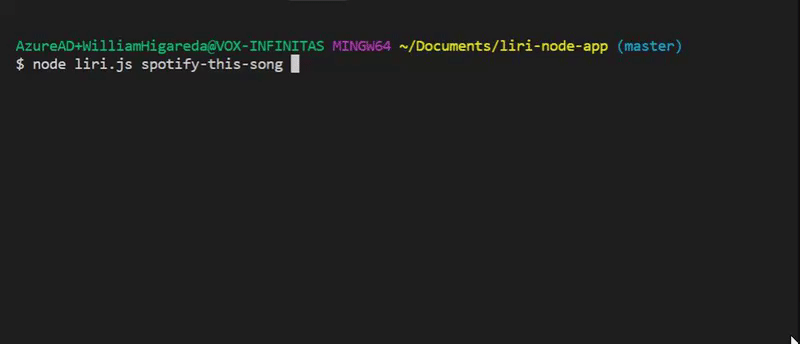
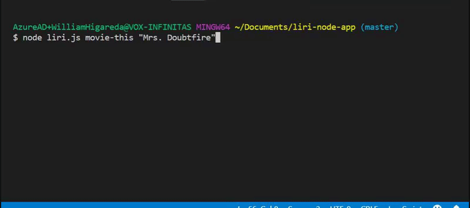
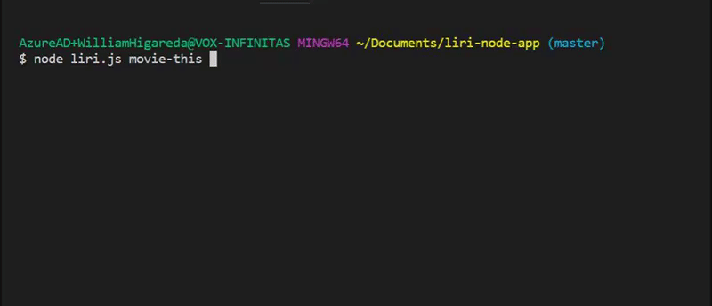
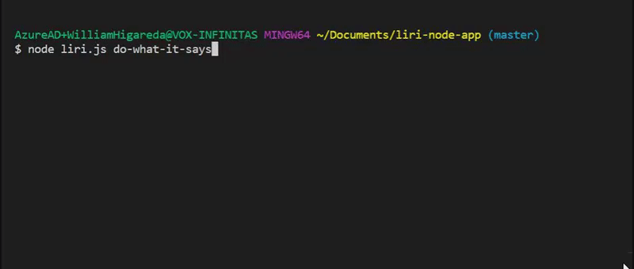

# liri-node-app

LIRI is like iPhone's SIRI. However, while SIRI is a Speech Interpretation and Recognition Interface, LIRI is a _Language_ Interpretation and Recognition Interface. LIRI will be a command line node app that takes in parameters and gives you back data.
 
* It must be ran in the command line.
* LIRI will do any of the below command when you enter them into the command line.
1. spotify-this-song
2. movie-this
3. do-what-it-says

* Type in node liri.js to get the instructions on how to enter the commands correctly.

# Spotify

*Command Syntax
```
node liri.js spotify-this-song '<song name here>'

node liri.js spotify-this-song
```
* shows the following information about the song in the terminal
	1. artist(s)
	2. album name
	3. song name
	4. preview URL
 
 * Example with a user pick:
 
 
 * Example without a user pick:
 
 
 # OMDB Database
 
 *Command Syntax
 ```
 node liri.js movie-this '<movie name here>'
 
 node liri.js movie-this  
 ```
 * this would output the following information to the terminal:
  1. Title of the movie.
  2. Year the movie came out.
  3. IMDB Rating of the movie.
  4. Rotten Tomatoes Rating of the movie.
  5. Country where the movie was produced.
  6. Language of the movie.
  7. Plot of the movie.
  8. Actors in the movie.
 
 * Example with a user pick:
 
 
 * Example without a user pick:
 
 
 # Do What It Says (random.txt)
 
*Command Syntax
```
node liri.js do-what-it-says
```

* Using the `fs` Node package, LIRI will take the text inside of random.txt and then use it to call one of LIRI's commands.

* Example:



# Copyright
Big Willie Style (C) 2019. All Rights Reserved.


